# Easy Credit

Video de demostración
---------------------

[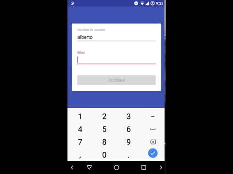](https://drive.google.com/open?id=1xK2NOZ_asxhtjgTzdMGRE3eQDeaENaUd)

Asunciones hechas
-----------------

#### Técnicas

- Opté por usar java para el backend:
  - Las dependencias se manejan en gradle, y se descargan automáticamente
  - Se utilizó el micro framework [pippo](https://pippo.ro/), que es un
  ruteador para endpoints, puede usarse para servicios REST y para servir
  páginas web; sólo utilicé servicios REST
  - Para la base de datos se usa SQLite, que por ser simple, sirve para
  esta actividad. Además que las consultas vienen incluidas en la misma
  aplicación web
  - Para la conexión a base de datos se usó [JDBI](http://jdbi.org/),
  el cual permite crear ORMs con interfaces y anotaciones con consultas
  SQL; su uso es bastante parecido a retrofit.
- El front end es una aplicación android, se utilizó lo siguiente
  - databinding
  - retrofit
  - gson
  - rxjava
- Pudo haber quedado más sencillo, aún así quise dejar una base de datos
un poco más sólida e íntegra (un par de catálogos en lugar de usar
campos simples)

#### Requerimientos

- La formula para calcular el interés no creo que sea exacta

Requerimientos no resueltos
---------------------------

- omití la opción para seleccionar tarjeta de crédito

Instrucciones para compilar, ejecutar y desplegar
-------------------------------------------------

Toda la solución funciona en AndroidStudio 3.1.3

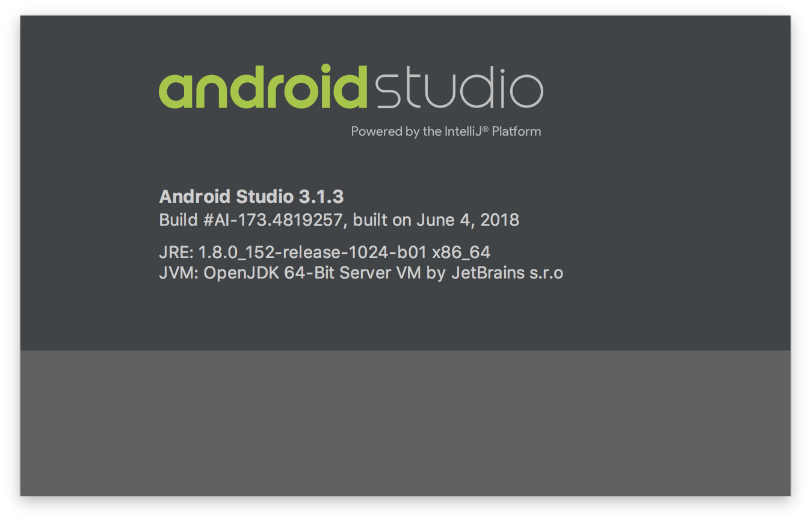

#### Para ejecutar la aplicación móvil

- Seleccione la configuración de la aplicación movil _ec-app_ y ejecute

#### Para ejecutar la aplicación web desde Android Studio

- Buscar la clase `org.shujito.ec.Application`
- Hacer click en la flecha para desplegar el menú, seleccionar _Run
'Application.main()'_ (la aplicación fallará en este paso)

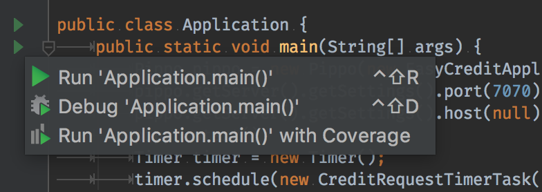

- Se generará una configuración de aplicación
- Edite las configuraciones

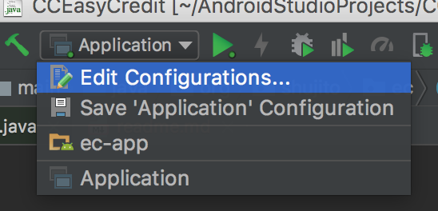

- Seleccione la configuración que se agregó

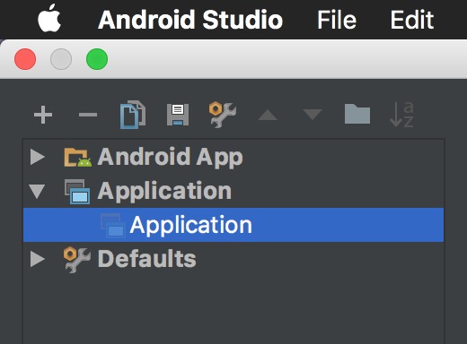

- Borre la instrucción _Build_

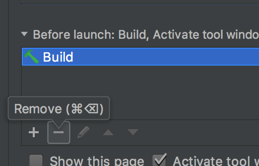

- Agregue una nueva instrucción de gradle

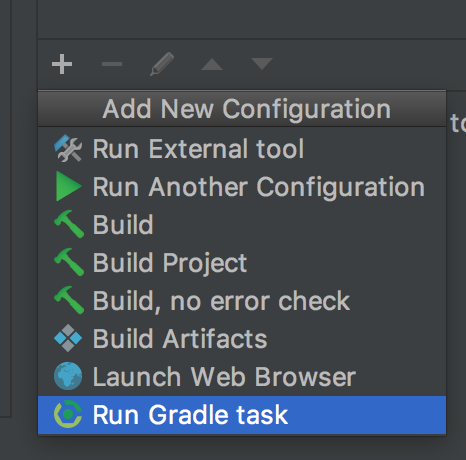

- Configure como en la imagen

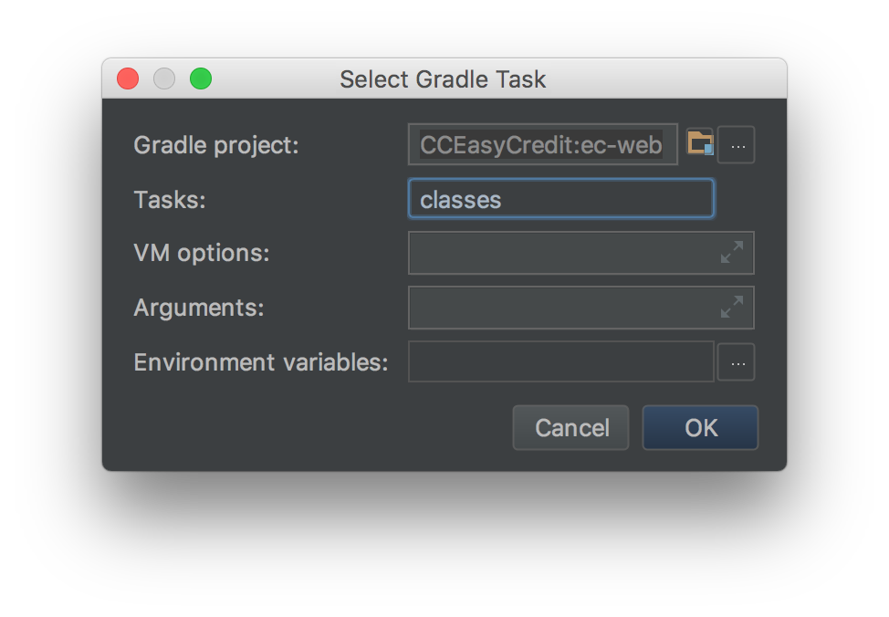

- Deberá quedar como en la imagen siguiente

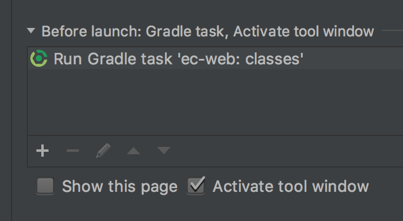

- Cambie también el directorio de trabajo a `$MODULE_DIR$`
- Es opcional cambiar el nombre de la configuración

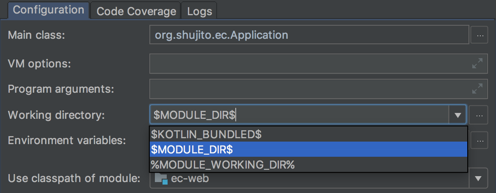

#### Desde la línea de comandos

Los siguientes comandos deben ser ejecutados en la carpeta del proyecto

###### Para ejecutar la aplicación web

    ./gradlew clean run

###### Para compilar el apk

    ./gradlew clean assembleDebug

se generará en `./ec-app/build/outputs/apk/debug/ec-app-debug.apk`

###### Para compilar y ejecutar jar independiente

    ./gradlew clean jar
    java -jar ec-web/build/libs/ec-web-0.1.jar

Instrucciones para ejecutar pruebas
-----------------------------------

Se ejecutan desde el IDE (Android Studio)

- Buscar la clase `org.shujito.ec.test.DatabaseTests`
- Hacer click en el círculo para ejecutar las pruebas

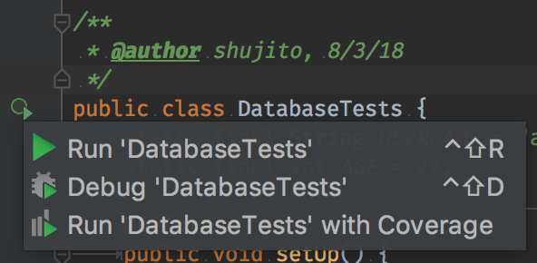

###### Problemas enfrentados

- Configurar las pruebas unitarias tomó tiempo
- Removí algunos formularios que hice en la aplicación móvil
- Creo que debí haber comenzado por el backend, pudo haber quedado más
simple la aplicación movil

###### Crítica hacia la activida

Las especificaciones que vienen en el documento aparentan ser
abrumadoras pero en realidad el proyecto está simple de entender, el
que se permita especificar asunciones y requerimientos no implementados
aligeró un poco la carga mental al momento de la entrega
